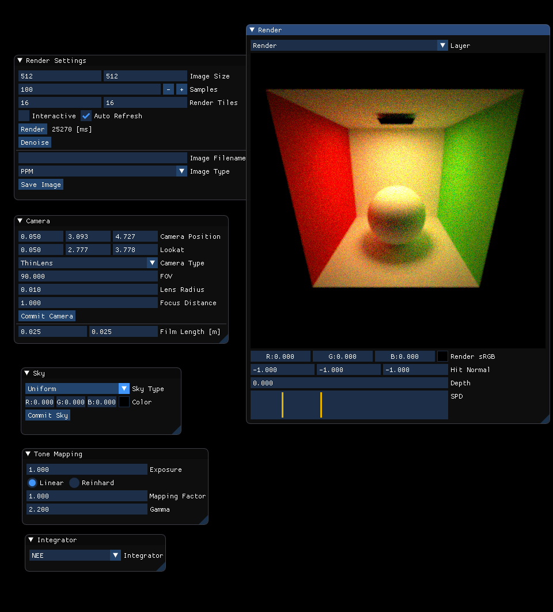

# Photorealism2

Full-Spectral Physically Based Renderer with GUI.



## Features

* Physically Based Rendering
* Spectral Rendering
* Realistic Camera Model
* Path Tracing
* Multi Importance Sampling
* OBVH Intersector
* Embree Intersector

## Requirements

* CMake(>= 3.12)
* [Intel Open Image Denoise](https://openimagedenoise.github.io/) 
* [Embree(>= 3.0)](https://www.embree.org/)

## Setup Externals

```zsh
git submodule update --init
```

## Configure CMake

If you use manually installed Intel Open Image Denoise and Embree, you need to set `OpenImageDenoise_DIR` and `embree_DIR` to path of manually installed libraries.

Below is an example.
```zsh
cmake -Dembree_DIR=/opt/embree -DOpenImageDenoise_DIR=/opt/oidn/lib/cmake/OpenImageDenoise ..
```

## Build

```zsh
mkdir build
cd build
cmake ..
cmake --build .
```

## Externals

* [GLFW3](https://github.com/glfw/glfw) - Zlib License.
* [Dear ImGui](https://github.com/ocornut/imgui) - MIT License.
* [Embree(3.6.1)](https://www.embree.org/)
* [Intel Open Image Denoise](https://openimagedenoise.github.io/) 
* [stb](https://github.com/nothings/stb) - Public Domain License.
* [ThreadPool](https://github.com/progschj/ThreadPool) - Zlib License.
* [tinyexr](https://github.com/syoyo/tinyexr) - 3-clause BSD License.
* [tinyobjloader](https://github.com/tinyobjloader/tinyobjloader) - MIT License.
* [HosekWilkie Sky Model](https://cgg.mff.cuni.cz/projects/SkylightModelling/) - 3-clause BSD License.